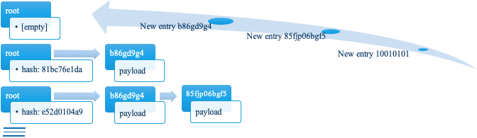
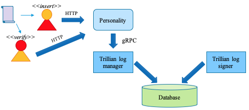

# Public - Confidential Certificate Transparency Service

This is a public version of the work carried out for the laboratory of systems engineering of the master of science in distributed systems engineering at the Technische Universität Dresden (TUD) on a confidential identity and access management system and defended in March 2022 by **Andre Miguel**.


## Motivation
Certificates are used to ensure authenticity and secure communication; they are everywhere in the internet and are fundamental to the establishment of trust between parties

* [Web Public Key Infrastructure](https://en.wikipedia.org/wiki/Public_key_infrastructure "A public key infrastructure (PKI) is a set of roles, policies, hardware, software and procedures needed to create, manage, distribute, use, store and revoke digital certificates and manage public-key encryption.") is a decentralized register
* [Certificate Transparency](https://certificate.transparency.dev/ "Certificate Transparency (CT) sits within a wider ecosystem, Web Public Key Infrastructure. Web PKI includes everything needed to issue and verify certificates used for TLS on the web. Certificates bind a public cryptographic key to a domain name, similar to how a passport brings together a person's photo and name.") is essential to ensure that a given Public Key is bound to that Certificate and that it is valid


### High security standards
Organizations that deal with high security requirements

* **Military**: needless to say that a command hierarchy must be projected to a hierarchy of trust, whence the misuse of technology employed can cause a war
* **State elections**: trust in the selection of a people’s representatives is crucial for the maintenance of a democratic state; therefore a technology aided election process must be publicly reliable
* **Financial services**: with the current trend of open banking, trust on “untrusted parties” to rely on your data is crucial
* **Industry 4.0**: the revolution in industry and manufacture poses a great challenge on converging many technologies to compose a new product or the very production line; henceforth trusting in 3rd party components can be a matter of avoiding personal harm or set lives at risk


## Addressing the subject
### Certificate Transparency Service
* Publicly accessible to push and consultation
* Certificates issued by a Certificate Authority (CA) should be trusted
* Verifying a certificated issued by a CA should be publicly accessible
* A compromised CA should be detected
* A revoked certificate should be identified
* [Log service](https://github.com/google/trillian/ "Trillian is an implementation of the concepts described in the Verifiable Data Structures white paper, which in turn is an extension and generalisation of the ideas which underpin Certificate Transparency.") that can log certificates and [provide](https://github.com/google/trillian#personalities "personality, that provides functionality that is specific to the particular application") certificate registration and verification services

### Confidential Certificate Transparency Service
* Privately accessible to push and/or consultation
* Run a confidential transparency service that can log certificates in a secure way
* Trustworthy log service, i.e., this service is not modified and is available only if it has an authentic attestation session
* Implement mechanisms to support confidentiality where it is required but [not available](https://github.com/google/certificate-transparency-go/tree/master/trillian/ "Trillian Certificate Transparency Personality")

### Confidential Computating
* SCONE (Secure container environment) for Docker images that uses TEE (Trusted Execution Environment) to run Linux applications in secure mode


## Theoretical baseline
### Verifiable Data Structures
Google developed a type of [data structure](https://github.com/google/trillian/blob/master/docs/papers/VerifiableDataStructures.pdf "data structures and their applications that allow adding transparency to the trust model, allowing an ecosystem to evolve from pure trust, to trust but verify") to be stored and made publicly available; a register inserted there can be certified as valid or invalid

Therefore an environment can be served of resources that can be trusted upon verification

#### Verifiable logs
* The structure used by [Trillian](https://github.com/google/trillian/ "Trillian: General Transparency") is an append-only log, where a valid new entry will be appended to it and can never be removed nor changed
* Every new appended entry will change the log’s state, hence a new “root hash” is computed

##### • Verifiable Data Structures

Consecutive computation of nodes hashes after every inclusion

#### Transparent Logging Services
Host for verifiable data structures

* Trillian provides verifiable log services used via a [Personality](https://github.com/google/trillian#personalities "Trillian core service needs to be paired with additional code, known as a personality"), an additional service developed according to the needs that will provide
* _admission criteria_: accept new records
* _canonicalization_: duplicate records will have the same identification, hence will not be stored
twice
* _external interface_: clients access to the records

##### • Transparent Logging Services

Simplified workflow of insertion and verification


## Porting Trillian to Confidential Computing
The transparency requirement together with confidentiality allows for a degree of security during the communication, whilst keeping the original intent of transparent modifications

### Adding Confidentiality to Personality
Trillian core systems come with SSL integrated to them, which is used in [gRPC](https://grpc.io/ "gRPC") and HTTPS, but it is not mandatory

* The Personality application has to implement its own secire channel
* Therefore a simple HTTP standard is not acceptable; an encapsulated HTTPS, provided by a new customized developed library and integrated to the system
• Snippet from `personality.go` (original HTTP versus confidential HTTPS)

##### • HTTP server (snippet)
```go
glog.Infof("Starting FT personality server...")
...
hServer := &http.Server{
	Addr: opts.ListenAddr,
	Handler: r, }
e := make(chan error, 1)
go func() {
	Addr: opts.ListenAddr,
	e <- hServer.ListenAndServe() close(e)
}()
<-ctx.Done()
glog.Info("Server shutting down") hServer.Shutdown(ctx)
return <-e
```

##### • HTTPS server (snippet)
```go
func CreateHttpsServer(address string, server_name []string, handler interface{}, client_auth_level tls.ClientAuthType, cert_pem_filename, cert_key_pem_filename, ca_cert_filename string) (*HttpsServer, error) {
	httpsServer := HttpsServer{
		address:               address,
		server_name:           server_name,
		handler:               handler,
		client_auth_level:     client_auth_level,
		cert_pem_filename:     cert_pem_filename,
		cert_key_pem_filename: cert_key_pem_filename,
		ca_cert_filename:      ca_cert_filename,
	}
	var newTlSConfig *tls.Config
	...
}
...
hServer, err := helper.CreateHttpsServer(opts.ListenAddr, server_names, r, tls.NoClientCert, cert_pem_filename, cert_key_pem_filename, ca_cert_filename) if err != nil {
	return fmt.Errorf("%s. Error: %w", "Error creating HTTPS server", err) }
e := make(chan error, 1)
go func() {
	e <- hServer.StartHttpsServer()
	close(e) }()
<-ctx.Done()
glog.Info("Server shutting down") hServer.StopHttpsServer(ctx)
return <-e
```


### Components
The Certificate Transparency Service is composed by:

* Trillian log manager
* Trillian log signer
* MySQL database server
* CT Server personality
* CT client